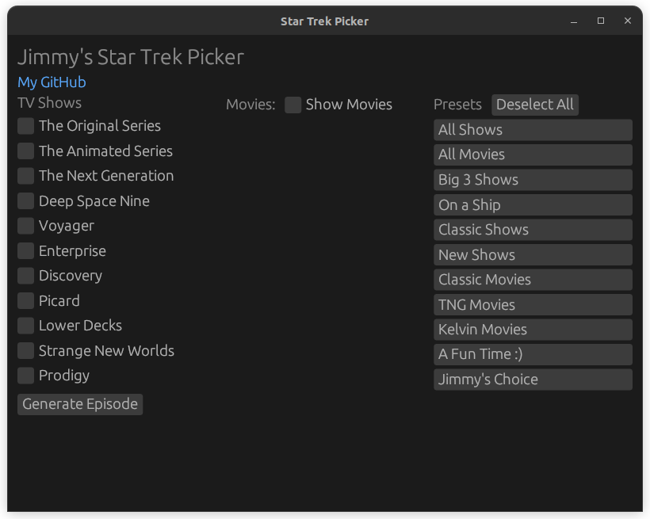

# Jimmy Ostler's Star Trek Episode Picker

### Running
The releases tab should have working binaries for Linux and Windows. Should it not, building from source will be necessary

### Building From Source

Building from source will require the rust toolchain. 
To install the rust toolchain on linux or macOS run:

```
$ curl --proto '=https' --tlsv1.2 -sSf https://sh.rustup.rs | sh
```

On windows, follow the instructions on the Rust language website.

Once that is done, clone the repository, cd into it, and cargo run it
```
$ git clone https://github.com/LordGoatius/star_trek_picker
$ cd star_trek_picker
$ cargo run --release
```

In the end, it should look like this!


